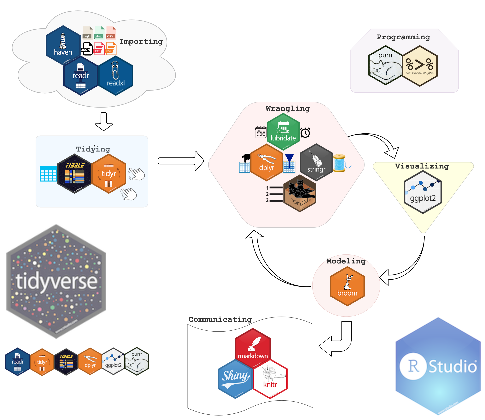

Quesgen- Intro\_to\_rstudio\_&\_the\_tidyverse
================

``` r
knitr::opts_chunk$set(
    echo = TRUE,
    tidy = FALSE,
    size = "small")
getwd()
```

    ## [1] "/Users/henrianna/Desktop/quesgendemo"

``` r
library(magrittr)
```

# Intro Topics

1.  R code basics & the `tidyverse`

2.  Locating and importing your data

3.  Renaming a variable (depression score)

4.  Factors

5.  Basic number summaries

6.  ggplot2 graphics

7.  Comparing means with t-tests

## R code basics & the `tidyverse`

This tutorial will give you a very brief introduction to a set of
packages developed by Hadley Wickham called the `tidyverse`.

A typical RStudio session will start with loading the necessary
packages, importing the data, then cleaning/wrangling/graphing/modeling
the data.

This tutorial will use the [tidyverse](http://tidyverse.org/) and the R
graphics cookbook packages
[gcookbook](https://cran.r-project.org/web/packages/gcookbook/gcookbook.pdf).



### R Code Basics

  - R is an **object** oriented programming language, and the primary
    object in R for storing data is the `vector` (other objects include
    matrices, arrays, and data frames).

  - Data manipulation and modeling in R is done using **functions**. If
    objects are the subjects of the R syntax, functions are the verbs
    (*functions do things to objects*).

  - Chaining multiple functions together can make your code hard to
    read, so we will be using the pipe operator (`%>%`) from the
    `magrittr` package. This allows your function calls to be read left
    to right (like a sentence).

  - In the R syntax, `#` is used to indicate a comment. These lines are
    not run by the console.

  - Most functions are written by R users and get loaded as part of a
    `package`. *You can see what package each function comes from using
    the `package::function()` format*.

-----

Install the packages we will be using for this tutorial using
`install.packages("gcookbook")`, `install.packages("mosaic")`, and
`install.packages("tidyverse")`.

``` r
library(mosaic)
library(gcookbook)
library(tidyverse)
```

-----

## Locating and importing your data

> “the most important piece of information on any map is your current
> position.” - Army Map Reading and Land Navigation Field Manual

Finding the files on your computer is easier when you know where the
document you are currently working in is located. We can find this using
the `dir("./")` command.

``` r
dir("./")
```

    ## [1] "HospAdminData.csv"                        
    ## [2] "importdataset.png"                        
    ## [3] "intro_to_rstudio_&_the_tidyverse.Rmd"     
    ## [4] "quesgendemo.Rproj"                        
    ## [5] "README-intro_to_rstudio_the_tidyverse.Rmd"
    ## [6] "tidyverse2.1.png"

We can also find the parent folder using two periods `dir("../")`

``` r
dir("../")
```

    ##  [1] "DB Training"                              
    ##  [2] "encaseforms"                              
    ##  [3] "Firefox.app"                              
    ##  [4] "git_install_n0tes.html"                   
    ##  [5] "git_install_n0tes.md"                     
    ##  [6] "Google Chrome.app"                        
    ##  [7] "John Muir VIP"                            
    ##  [8] "qghmis"                                   
    ##  [9] "quesgendemo"                              
    ## [10] "QuesgenDemo-master"                       
    ## [11] "Recode"                                   
    ## [12] "Screen Shot 2018-10-08 at 12.14.35 PM.png"
    ## [13] "Screen Shot 2018-10-08 at 12.14.54 PM.png"
    ## [14] "SEG"                                      
    ## [15] "Test"                                     
    ## [16] "testrepo"

Fortunately, we are using the R project file so everything is right
where we need it. I recommend using these as opposed to setting the
working directory in a script (read more
[here](https://www.tidyverse.org/articles/2017/12/workflow-vs-script/)).

Now that we can see the files in our current folder, we should import
the `HospAdminData.csv` data set using the `readr::read_csv` command.

``` r
HospAdminData <- readr::read_csv("HospAdminData.csv")
```

    ## Parsed with column specification:
    ## cols(
    ##   SubjectID = col_integer(),
    ##   Sex = col_character(),
    ##   Age = col_integer(),
    ##   PatientType = col_character(),
    ##   BSI18DeprScoreRaw = col_integer(),
    ##   DeathCause = col_character(),
    ##   DeathTimeSinceInj = col_character()
    ## )

**TIP:** the assignment operator is `<-` but you can use `=`.

We get some useful information about the data import when the function
is executed: 1) we can see the names of the columns in `cols()` and 2)
we can see the data type R recognized and imported them as (note
`read_csv()` doesn’t require `stringsAsFactors = FALSE`\! Read more
about this annoying bug
[here](https://simplystatistics.org/2015/07/24/stringsasfactors-an-unauthorized-biography/)).

This created a `tbl_df` or “tibble” named `HospAdminData`. These objects
print nicely in the RStudio window. You can view this new object by
simply typing the name into the script. Try it below.

``` r
HospAdminData
```

    ## # A tibble: 828 x 7
    ##    SubjectID Sex     Age PatientType BSI18DeprScoreR… DeathCause
    ##        <int> <chr> <int> <chr>                  <int> <chr>     
    ##  1      1001 2:Fe…    88 3:Hospital…                1 <NA>      
    ##  2      1004 1:Ma…    22 2:Hospital…                4 <NA>      
    ##  3      1006 2:Fe…    28 1:ED Disch…                5 <NA>      
    ##  4      1008 2:Fe…    65 1:ED Disch…                1 <NA>      
    ##  5      1018 1:Ma…    42 3:Hospital…                1 <NA>      
    ##  6      1017 1:Ma…    52 2:Hospital…                1 <NA>      
    ##  7      1022 2:Fe…    20 3:Hospital…                6 <NA>      
    ##  8      1023 1:Ma…    42 3:Hospital…                1 <NA>      
    ##  9      1025 2:Fe…    26 1:ED Disch…                1 <NA>      
    ## 10      1034 1:Ma…    36 3:Hospital…                1 <NA>      
    ## # ... with 818 more rows, and 1 more variable: DeathTimeSinceInj <chr>

You can also do this using the **Import Dataset** tool in the RStudio
**Environment** pane.


\_Note the `read_csv` command produced by RStudio.

**DATA PROVENANCE:** It is helpful to know where everything in your
analysis came from (especially the data). This entire tutorial is up on
Github, so we should include a link to the repo in our script/Rmarkdown
file or–even better–download the data from the repo in our script (shown
below).

``` r
HospAdminData_url <- "https://raw.githubusercontent.com/mjfrigaard/QuesgenDemo/master/HospAdminData.csv"
HospAdminData_destfile <- "HospAdminData.csv"
download.file(HospAdminData_url, HospAdminData_destfile)
```

We can check with `dir(./)`

``` r
dir("./")
```

    ## [1] "HospAdminData.csv"                        
    ## [2] "importdataset.png"                        
    ## [3] "intro_to_rstudio_&_the_tidyverse.Rmd"     
    ## [4] "quesgendemo.Rproj"                        
    ## [5] "README-intro_to_rstudio_the_tidyverse.Rmd"
    ## [6] "tidyverse2.1.png"

-----

#### What does your data look like?

You can get the structure of your data using `str()` or
`dplyr::glimpse()`

``` r
str(HospAdminData)
```

    ## Classes 'tbl_df', 'tbl' and 'data.frame':    828 obs. of  7 variables:
    ##  $ SubjectID        : int  1001 1004 1006 1008 1018 1017 1022 1023 1025 1034 ...
    ##  $ Sex              : chr  "2:Female" "1:Male" "2:Female" "2:Female" ...
    ##  $ Age              : int  88 22 28 65 42 52 20 42 26 36 ...
    ##  $ PatientType      : chr  "3:Hospital admit with ICU" "2:Hospital admit no ICU" "1:ED Discharge" "1:ED Discharge" ...
    ##  $ BSI18DeprScoreRaw: int  1 4 5 1 1 1 6 1 1 1 ...
    ##  $ DeathCause       : chr  NA NA NA NA ...
    ##  $ DeathTimeSinceInj: chr  NA NA NA NA ...
    ##  - attr(*, "spec")=List of 2
    ##   ..$ cols   :List of 7
    ##   .. ..$ SubjectID        : list()
    ##   .. .. ..- attr(*, "class")= chr  "collector_integer" "collector"
    ##   .. ..$ Sex              : list()
    ##   .. .. ..- attr(*, "class")= chr  "collector_character" "collector"
    ##   .. ..$ Age              : list()
    ##   .. .. ..- attr(*, "class")= chr  "collector_integer" "collector"
    ##   .. ..$ PatientType      : list()
    ##   .. .. ..- attr(*, "class")= chr  "collector_character" "collector"
    ##   .. ..$ BSI18DeprScoreRaw: list()
    ##   .. .. ..- attr(*, "class")= chr  "collector_integer" "collector"
    ##   .. ..$ DeathCause       : list()
    ##   .. .. ..- attr(*, "class")= chr  "collector_character" "collector"
    ##   .. ..$ DeathTimeSinceInj: list()
    ##   .. .. ..- attr(*, "class")= chr  "collector_character" "collector"
    ##   ..$ default: list()
    ##   .. ..- attr(*, "class")= chr  "collector_guess" "collector"
    ##   ..- attr(*, "class")= chr "col_spec"

``` r
dplyr::glimpse(HospAdminData)
```

    ## Observations: 828
    ## Variables: 7
    ## $ SubjectID         <int> 1001, 1004, 1006, 1008, 1018, 1017, 1022, 10...
    ## $ Sex               <chr> "2:Female", "1:Male", "2:Female", "2:Female"...
    ## $ Age               <int> 88, 22, 28, 65, 42, 52, 20, 42, 26, 36, 30, ...
    ## $ PatientType       <chr> "3:Hospital admit with ICU", "2:Hospital adm...
    ## $ BSI18DeprScoreRaw <int> 1, 4, 5, 1, 1, 1, 6, 1, 1, 1, 10, 1, 4, 7, 1...
    ## $ DeathCause        <chr> NA, NA, NA, NA, NA, NA, NA, NA, NA, NA, NA, ...
    ## $ DeathTimeSinceInj <chr> NA, NA, NA, NA, NA, NA, NA, NA, NA, NA, NA, ...

### The pipe `%>%`

Pipes makes your life easier and make writing R code more like writing a
sentence. The pipe `%>%` moves whatever was on the left side of a
function and sends it to the first argument of the function, but on the
right side. This makes it possible to write your functions left to right
(i.e. in a pipeline).

So this:

`str(HospAdminData)`

Becomes this:

`HospAdminData %>% str()`

This might not seem like a big deal at first, but many times we want to
use multiple functions, so putting them in a pipeline is better than
writing them inside-out.

``` r
third_function( <- the last function 
    second_function(
        (first_function(
                HospAdminData # <- the object 
                        )
                    )
               )
```

Try using the pipe on the `HospAdminData` to see the `names()` in the
data set.

``` r
HospAdminData %>% names()
```

    ## [1] "SubjectID"         "Sex"               "Age"              
    ## [4] "PatientType"       "BSI18DeprScoreRaw" "DeathCause"       
    ## [7] "DeathTimeSinceInj"

##### Checking the shape of a data set

If you want to check the number of observations in your data, use
`base::nrow()`

``` r
HospAdminData %>% base::nrow()
```

    ## [1] 828

Or check the number of variables in your data, use `base::ncol()`

``` r
HospAdminData %>% base::ncol()
```

    ## [1] 7

Or get both with the `base::dim()` function:

``` r
HospAdminData %>% base::dim()
```

    ## [1] 828   7

You can also use the top of your data with `Matrix::head()` and
`Matrix::tail()`.

``` r
HospAdminData %>% Matrix::head()
```

    ## # A tibble: 6 x 7
    ##   SubjectID Sex     Age PatientType BSI18DeprScoreR… DeathCause
    ##       <int> <chr> <int> <chr>                  <int> <chr>     
    ## 1      1001 2:Fe…    88 3:Hospital…                1 <NA>      
    ## 2      1004 1:Ma…    22 2:Hospital…                4 <NA>      
    ## 3      1006 2:Fe…    28 1:ED Disch…                5 <NA>      
    ## 4      1008 2:Fe…    65 1:ED Disch…                1 <NA>      
    ## 5      1018 1:Ma…    42 3:Hospital…                1 <NA>      
    ## 6      1017 1:Ma…    52 2:Hospital…                1 <NA>      
    ## # ... with 1 more variable: DeathTimeSinceInj <chr>

``` r
HospAdminData %>% Matrix::tail()
```

    ## # A tibble: 6 x 7
    ##   SubjectID Sex     Age PatientType BSI18DeprScoreR… DeathCause
    ##       <int> <chr> <int> <chr>                  <int> <chr>     
    ## 1      2968 2:Fe…    34 2:Hospital…                3 <NA>      
    ## 2      2970 2:Fe…    19 2:Hospital…                2 <NA>      
    ## 3      2972 1:Ma…    29 2:Hospital…                5 <NA>      
    ## 4      2986 1:Ma…    26 2:Hospital…                2 <NA>      
    ## 5      3000 1:Ma…    38 2:Hospital…               12 <NA>      
    ## 6      3008 1:Ma…    21 3:Hospital…                1 <NA>      
    ## # ... with 1 more variable: DeathTimeSinceInj <chr>

***IMPORTANT TAKEAWAYS ABOUT DATA STRUCTURE:***

I recommend using the `dplyr::glimpse()` function more than any of the
other functions above. It prints the most amount of your data to the
screen (Observations, Variables, Format, Names, Data Values).

``` r
HospAdminData %>% glimpse()
```

    ## Observations: 828
    ## Variables: 7
    ## $ SubjectID         <int> 1001, 1004, 1006, 1008, 1018, 1017, 1022, 10...
    ## $ Sex               <chr> "2:Female", "1:Male", "2:Female", "2:Female"...
    ## $ Age               <int> 88, 22, 28, 65, 42, 52, 20, 42, 26, 36, 30, ...
    ## $ PatientType       <chr> "3:Hospital admit with ICU", "2:Hospital adm...
    ## $ BSI18DeprScoreRaw <int> 1, 4, 5, 1, 1, 1, 6, 1, 1, 1, 10, 1, 4, 7, 1...
    ## $ DeathCause        <chr> NA, NA, NA, NA, NA, NA, NA, NA, NA, NA, NA, ...
    ## $ DeathTimeSinceInj <chr> NA, NA, NA, NA, NA, NA, NA, NA, NA, NA, NA, ...

-----

## Renaming Variables

The depression score variable `BSI18DeprScoreRaw` is long and hard to
write out (also not very intuitive), so let’s rename it something more
meaningful. We can do this with the `dplyr::rename()` function.

*This package was loaded at the beginning of the session in the
`tidyverse`*.

The syntax inside the `dplyr::rename()` function is to have the **new
name on the left-hand side** of the `=` sign and the **old name on the
right-hand side**.

Let’s also rename everything so it’s lowercase (as opposed to CamelCase)
and uses underscores
(`_`).

``` r
HospAdminData <- HospAdminData %>% dplyr::rename(depression = BSI18DeprScoreRaw)
```

Now let’s see if it worked:

``` r
HospAdminData %>% glimpse()
```

    ## Observations: 828
    ## Variables: 7
    ## $ SubjectID         <int> 1001, 1004, 1006, 1008, 1018, 1017, 1022, 10...
    ## $ Sex               <chr> "2:Female", "1:Male", "2:Female", "2:Female"...
    ## $ Age               <int> 88, 22, 28, 65, 42, 52, 20, 42, 26, 36, 30, ...
    ## $ PatientType       <chr> "3:Hospital admit with ICU", "2:Hospital adm...
    ## $ depression        <int> 1, 4, 5, 1, 1, 1, 6, 1, 1, 1, 10, 1, 4, 7, 1...
    ## $ DeathCause        <chr> NA, NA, NA, NA, NA, NA, NA, NA, NA, NA, NA, ...
    ## $ DeathTimeSinceInj <chr> NA, NA, NA, NA, NA, NA, NA, NA, NA, NA, NA, ...

***What if we only wanted to see the result of `depression` and not the
entire data frame?***

To see a single column within a data frame or tibble, you have to use
subset notation. There are many options for sub-setting columns in data
frames, but we will stick with the commonly used `dataframe$column`
notation.

``` r
HospAdminData$depression %>% glimpse()
```

    ##  int [1:828] 1 4 5 1 1 1 6 1 1 1 ...

**TIP:** You can use the `dplyr::select()` function to rename and
reorder columns.

``` r
HospAdminData <- HospAdminData %>% 
    dplyr::select(
        sub_id = SubjectID,
        sex = Sex,
        age = Age,
        pat_type = PatientType,
        depression,
        death_cause = DeathCause,
        death_time = DeathTimeSinceInj)
HospAdminData %>% glimpse()
```

    ## Observations: 828
    ## Variables: 7
    ## $ sub_id      <int> 1001, 1004, 1006, 1008, 1018, 1017, 1022, 1023, 10...
    ## $ sex         <chr> "2:Female", "1:Male", "2:Female", "2:Female", "1:M...
    ## $ age         <int> 88, 22, 28, 65, 42, 52, 20, 42, 26, 36, 30, 31, 71...
    ## $ pat_type    <chr> "3:Hospital admit with ICU", "2:Hospital admit no ...
    ## $ depression  <int> 1, 4, 5, 1, 1, 1, 6, 1, 1, 1, 10, 1, 4, 7, 1, 3, 1...
    ## $ death_cause <chr> NA, NA, NA, NA, NA, NA, NA, NA, NA, NA, NA, NA, NA...
    ## $ death_time  <chr> NA, NA, NA, NA, NA, NA, NA, NA, NA, NA, NA, NA, NA...

This looks like what we would expect to find (based on what we already
know about about these data).

## Factors

Factors storing individual text strings as `integers`, combined with a
set of character `labels` that match the integers back to the text. We
want to convert our `sex` variable to a factor, but first we need to
clean it up a bit. The numerical value and colon that precedes the text
for sex needs to be removed from these values. We can accomplish this
with the `stringr::str_remove()` function and a new pipe operator.

``` r
# If you need to see the named elements of an object, you can use `%$%`.
# test
HospAdminData %$% str_remove(sex,
                             pattern = "2:") %>% head()
```

    ## [1] "Female" "1:Male" "Female" "Female" "1:Male" "1:Male"

``` r
# assign
HospAdminData$sex <- HospAdminData %$% str_remove(sex,
                             pattern = "2:")
# verify
HospAdminData$sex %>% head()
```

    ## [1] "Female" "1:Male" "Female" "Female" "1:Male" "1:Male"

This introduces my three steps for cleaning variables: 1) **test** the
function or pipeline (and actually look at the result) 2) assign the
function back to the data frame 3) verify everything was done correctly
(test if possible).

We can repeat this process for the `1:Male` data.

``` r
# test
HospAdminData %$% str_remove(sex,
                             pattern = "1:") %>% head()
```

    ## [1] "Female" "Male"   "Female" "Female" "Male"   "Male"

``` r
# assign
HospAdminData$sex <- HospAdminData %$% str_remove(sex,
                             pattern = "1:")
# verify
HospAdminData$sex %>% head()
```

    ## [1] "Female" "Male"   "Female" "Female" "Male"   "Male"

Great\! Now we can convert this variable to a factor (and test it with
`base::is.factor()`).

``` r
HospAdminData$sex <- factor(HospAdminData$sex)
base::is.factor(HospAdminData$sex)
```

    ## [1] TRUE

-----

## Number summaries

A simple five number summary can be called using `mosaic::fivenum()`
function.

``` r
library(mosaic)
HospAdminData %$% fivenum(depression) # note different pipe
```

    ## [1]  1  2  4  8 24

This is nice, but `base::summary()` provides more information.

``` r
HospAdminData %$% summary(depression)
```

    ##    Min. 1st Qu.  Median    Mean 3rd Qu.    Max. 
    ##   1.000   2.000   4.000   5.616   8.000  24.000

Or if we want the result in a tibble, we can use `mosaic::favstats()`

``` r
HospAdminData %$% favstats(depression)
```

    ##  min Q1 median Q3 max     mean       sd   n missing
    ##    1  2      4  8  24 5.615942 4.697354 828       0

-----

## Visualizations using `ggplot2`

A quick overview of the `ggplot2` syntax:

1.  `ggplot()` creates a **coordinate system**

2.  The first arguments are the `(data = HospAdminData)` and an
    aesthetic **mapping argument**, `aes()` of variables.

3.  Graphs are built in layers, added (`+`) with geometric objects or
    ‘geoms’ (`geom_`). For example, the `geom_point()` geom creates a
    scatter plot.

So in general, the **`ggplot2`** template is:

    ggplot(data = <DATA>) +
    <GEOM_FUNCTION>(mapping = aes(<MAPPINGS>))

``` r
HospAdminData %>% ggplot(aes(depression)) +
    geom_histogram()
```

    ## `stat_bin()` using `bins = 30`. Pick better value with `binwidth`.

<!-- -->

We can see the message “`stat_bin()` using `bins = 30`. Pick better
value with `binwidth`.”. We will follow this advice with `binwidth = 1`

``` r
HospAdminData %>% ggplot(aes(depression)) +
    geom_histogram(binwidth = 1)
```

<!-- -->

`ggplot2` offers maximum flexibility with building plots. For example, I
can use the `fill` aesthetic and `alpha` arguments to start to break
down distributions of `depression` across levels of `sex`.

``` r
HospAdminData %>% 
    ggplot(aes(x = depression, 
               fill = sex)) +
            geom_histogram(position = "identity",
                           alpha = 0.4,
                           binwidth = 1)
```

<!-- -->

Or I can use the `color` argument with a different geom to see the
distribution of `depression` between `sex`.

``` r
HospAdminData %>% 
    ggplot(aes(x = depression, 
               color = sex)) +
            geom_freqpoly(position = "identity", 
                           binwidth = 1)
```

<!-- -->

Or I can use faceting to see the difference in `depression` scores
between `sex`.

``` r
HospAdminData %>% 
    ggplot(aes(depression, fill = sex)) + # the data and the variables
                geom_histogram(binwidth = 1) + # the geom (histogram) layer
                        facet_wrap(~ sex, 
                                   ncol = 1) # the facet layer
```

<!-- -->

If I want to separate the bars according to their percents (and add
`labels`), I can use the `geom_bar()` and `scale_y_continuous`
functions.

``` r
HospAdminData %>% ggplot(aes(x = sex)) +  
        geom_bar(aes(y = (..count..)/sum(..count..))) + 
            scale_y_continuous(labels = scales::percent) + 
            xlab("Patient Sex") +
            ylab("Percent")
```

<!-- -->

This has been a very quick introduction to `ggplot2` graphs, read more
[here](http://www.storybench.org/getting-started-data-visualization-r-using-ggplot2/)

-----

## Basic Statistical Tests

Statistical tests and models attempt to quantify patterns between
variables and the strength of these patterns. This typically requires
comparing mathmatical summaries of each variable (like the mean or
median) to example the strength of each relationship. For example, if we
want to compare the mean `depression` score between `sex`, we would need
to summarize each variable to a single number, then compare these two
numbers to see how different they are (we already know they are
different from the graphs above). We can do this using the t-test.

### The T-Test

The t-test command in R is fairly straightforward. If you have the data
for different groups stored in a single column, then the `t.test()`
function looks like
    this:

    ttest_model <- t.test(outcome ~ predictor, data = dataFrame, paired = FALSE/TRUE)

If we wanted to look at a t-test of `despression` vs. `sex`, the command
would
be:

``` r
ttest_model <- t.test(depression ~ sex, data = HospAdminData, paired = FALSE)
ttest_model 
```

    ## 
    ##  Welch Two Sample t-test
    ## 
    ## data:  depression by sex
    ## t = 1.8302, df = 524.51, p-value = 0.06779
    ## alternative hypothesis: true difference in means is not equal to 0
    ## 95 percent confidence interval:
    ##  -0.04770159  1.34738173
    ## sample estimates:
    ## mean in group Female   mean in group Male 
    ##             6.042105             5.392265

We can see here that the mean depression score for males was `5.39` vs.
`6.04` for the females. However, these differences were not significant
at an alpha level of 0.05. \* *This is also apparent because our 95%
confidence interval crosses 0 (`-1.35` - `0.05`)*

If we want to keep this file as a script, use
`knitr::purl("intro_to_rstudio_&_the_tidyverse.Rmd")` to create an R
script from the Rmarkdown.

``` r
# knitr::purl("intro_to_rstudio_&_the_tidyverse.Rmd")
```
